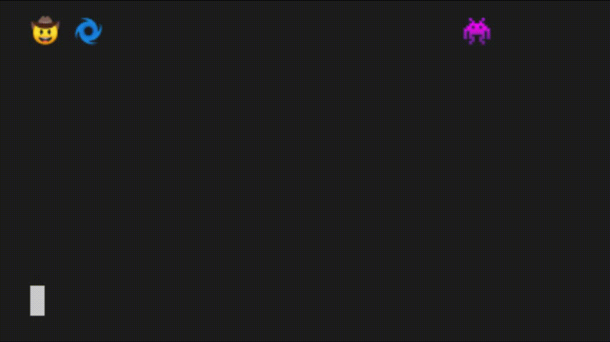

# Boomerang!

## Введение
Настало время разрабатывать лучшие в мире игры с футуристичной графикой и тщательно подуманной физикой! Что вам для этого надо? Emoji! И конечно же навыки работы с базами данных. Так же вам очень пригодятся ваши навыки работы с ООП.

Как же будет выглядеть игра? В игре будет главный герой, за которого играете вы. Задайте ему какой-нибудь emoji. Так же в игре будут враги. Для начала сделайте так, чтобы был лишь один враг. Найдите emoji и для него. Вероятно, вы уже предполагаете что надо делать дальше? Сразиться с вашим врагом! Вы стоите на расстоянии друг от друга. У вас есть бумеранг, который вы можете кинуть, и он вернётся к вам. У врага же нет ничего, однако если он вас коснется, то вы моментально проиграли. Представили? Вы можете развивать игру! Сделать так, чтобы врагов было много, они появлялись с разным количеством жизней, разной скоростью, в разном обличии и так далее, но начните с MVP. И не забывайте, что вам обязательно надо хранить данные в `postgres`!

> Вам возможно пригодятся следующие модули:
>- `sequelize`
>- `keypress` или `readline`
>- `play-sound`

*Начнём?*

## Releases

### Release 0. О! А это что за файлы?
Да, у вас уже есть некоторая структура проекта, заготовки классов и методов. Дело в том, что ваш старый приятель (тот самый фермер Фёдор :tractor:) когда-то давно, в школьные годы, уже сделал такую игру, но его никто не учил пользоваться `git`. Поэтому мы попросили его вспомнить хотя бы основную структуру его проекта, и вот что из этого вышло. Вы не обязаны использовать предложенную структуру, однако рекомендуем вам  в любом случае её изучить. Вдруг натолкнёт на какие-то мысли! 

- `run.js` - Скрипт для запуска игры. Все настройки игры прокидываются здесь.
- `src/Game.js` - Главный класс игры. Своего рода контроллер, в котором связываются все остальные классы между собой. Также тут происходит проверка текущего состояния игры, вызывается `View` для отрисовки.
- `src/View.js` - Помните про `MVC`? Так вот это `V`. Класс, отвечающий за отрисовку игры в коносоли.
- `src/keyboard.js` - Скрипт, который пока что не связан с другими файлами проекта, но он может оказаться очень полезным. Он поможет вам настроить управление и научиться работать с событиями нажатия на клавиши.
- `src/game-models/Hero.js` - Класс нашего персонажа. Тут вся логика передвижений, бросания бумеранга и тд.
- `src/game-models/Enemy.js` - Класс врага.
- `src/game-models/Boomerang.js` - Класс бумеранга. Вместо бумеранга можете придумать и что-то своё, а можете сделать несколько типов оружия. Не забудьте передать оружие своему персонажу. Кстати, можно сделать так, чтобы игрок мог выбирать оружие в начале игры.
  

### Release 1. Спроектируем логику игры?
Подумайте над логикой игры. Сначала продумайте что вы хотите получить в [MVP](https://en.wikipedia.org/wiki/Minimum_viable_product). Для этого не надо писать код! Соберитесь вместе со своей командой и устройте brainstorm! Записывайте все идеи на листочке, рисуйте картинки и схемы! Подумайте что вы вообще хотите получить к концу рабочего дня.

- Как вы будете рисовать себя и врага? 
- Как будет лететь бумеранг? 
- Что произойдет, когда он коснётся врага? 
- Будете ли вы разделять в коде логику и отображение? (Что если вас в дальнейшем попросят переписать все в веб версию: как написать код изначально так, чтобы перенос в веб был не столь болезненным?)
- Какой дополнительный функционал вы бы хотели реализовать?

Список вопросов, которые вам стоит обсудить, должен получиться достаточно большим. Попробуйте продолжить сами!

### Release 2. Что в базе данных?

Что вы хотите хранить в базе данных? Ничего? Нет, так не пойдет. Надо сделать так, чтобы в эту игру играли по всему миру, и чтобы результаты всех игроков можно было посмотреть спустя 10 лет. Как минимум вам надо хранить: 
- Пользователей которые играли в игру. Вы можете сделать регистрацию на игру, чтобы человек сначала вводил своё имя (можно добавить и другие данные), а потом мог играть.
- Результаты каждой игры. Это необходимо для составления статистики игроков, рейтингов и тд. В результатах может быть время игры, сколько врагов было убито и другие параметры - зависит от вашей реализации игры.
- Врагов. Они могут иметь разные параметры: внешний вид, скорость, живучесть, может даже оружие. Поэтому будет классно, если возможные враги будут храниться в базе данных, и вытаскиваться оттуда при старте игры.

Вам предстоит подготовить схемы для указанных сущностей. Можете хранить в базе данных и другую информацию, если ваша реализация будет этого требовать. Схема базы данных может изменяться в ходе разработки.

*Ну как успехи?*

### Release 3. MVP
Логика продумана, и модели БД уже заполнили весь ваш жесткий диск? Отлично. Переходите к созданию MVP. Он должен быть несложным. Например, вы можете реализовать следующий функционал:
- Регистрация на игру;
- Отображение главного персонажа и врага;
- Возможность бросать бумеранг по нажатию на клавишу;
- Сохранение результатов в БД (пользователь, сколько врагов победил, за сколько прошел игру).

*Пример MVP*

Однако можете сделать и свой вариант. Главное, чтобы это был MVP. Не усложняйте.

### Release 4. Развиваем

Основы есть. Теперь пора реализовывать все ваши пожелания. Что бы вы хотели от этой игры? Вспомните ваши командные обсуждения. Скорее всего вы придумали много интересных фич. Какой функционал вы хотите реализовать в первую очередь? **Можно вернуться к этапу проектирования и еще раз всё обсудить со своей командой.** Развивайте игру в любую сторону, поделите фичи между всеми участниками команды и делайте их каждый в своей ветке. Но не забудьте, что вам надо будет слить всё воедино. И постарайтесь пользоваться базой данных везде где только можно!
Если вы не знаете что хотите - мы предлагаем вам реализовать следующий функционал:
- В базе данных должны храниться герои за которых можно играть. У них может отличаться внешний вид, оружие, другие параметры.
- После регистрации на игру - пользователю предоставляется возможность выбора персонажа.
- Пользователь может управлять героем: перемещать его вправо-влево.
- Враги бегут на вашего героя (Zombie mode).
- Если враг коснулся героя - вы проиграли.
- Вы можете кидать бумеранг, нажимая на клавишу броска.
- Если бумеранг касается врага - враг погибает, но тут же появляется новый. 

*Пример игры с предложенным функционалом*

На анимации выше отсутствует выбор персонажа, так как Фёдор в своё время не смог вытащить эту информацию из базы данных. К счастью у вас с базами данных дела обстоят намного лучше!

### Release 5000. Advanced

Всё очень просто? Вы уже сделали всё что требовалось и больше? Ну попробуйте добавить такой функционал:
- Поле теперь двумерное. Это значит вы можете двигаться еще и вверх-вниз.
- Врагов много, они идут по разным дорожкам. Если враг дошёл до начала своей дорожки - он возвращается в её конец и немного ускоряется.
- Когда вы убиваете врага, то через секунду появляется новый, более сильный, скорость которого уже больше.
- Бумеранг теперь возвращается не к вам в руки, а немного не долетает. Вам нужно его подобрать, чтобы можно было кинуть его снова. И если бумеранг просто лежит, то он не может никак повлиять на врагов, они просто будут проходить мимо.
- Можно добавить игровое меню. Чтобы в начале игры пользователь мог зарегистрироваться или войти, перейти в настройки, выбрать уровень сложности, выбрать персонажа, посмотреть рейтинг игроков, сыграть в игру.

*Пример Advanced реализации*

Если вы и с этим справились, то вам остаётся только включать креатив и развивать вашу игру самостоятельно! А потом можете смело записывать её на CD-диск и продавать :)

### Вывод
Надеюсь, вы получили удовольствие от данного проекта, потому что это была самая главная цель! Также важно, что вы попрактиковались в работе с базой данных, попроектировали приложение, используя ООП подход, продумали логику игры, поработали с вводом/выводом, развили креативное мышление и сделали это всё, работая в команде ❤
